<p align="center"></p>

# 天际航线 SkyRoute(仅娱乐,不喜勿喷)

> 本项目原名「飞行模拟器 · Flight Simulator」，自 beta 0.3 起更名为 **天际航线 SkyRoute**（GitHub 仓库名保持 `Flight-Simulator` 不变）。

一个**网页版民航客机飞行模拟器**。用真实六自由度飞行动力学驱动，
包含 11 种民航机型、77 个真实机场、10 个飞行场景和完整的玻璃座舱航电。

不需要安装任何东西，不需要构建，**离线即可完整游玩**；联网时可选加载全球真实卫星影像与地形（beta 0.3）。
Windows 用户可下载**便携版 zip**（见 [Releases](https://github.com/kevinyuzekai/Flight-Simulator/releases)）；商店用 MSIX。本版 **无 NSIS Setup.exe**（旧版「如有 Setup」可安装）。

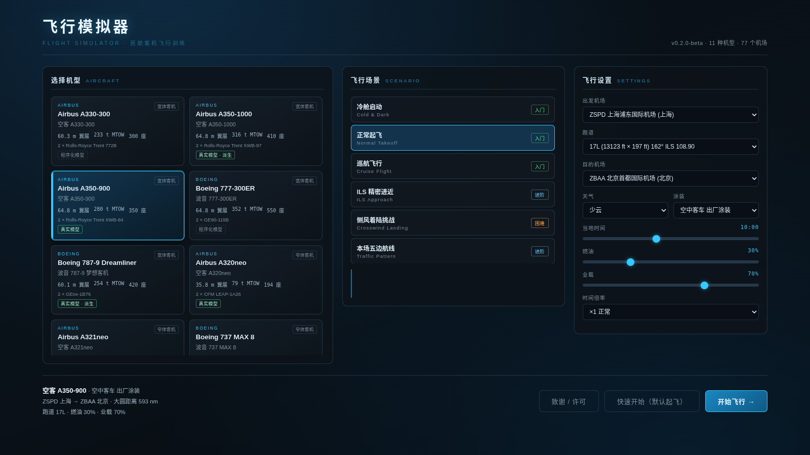

---

## beta 0.4 更新

- **更多立体机场**：机场库中的大型机场改用 OpenStreetMap 数据（© OpenStreetMap contributors，ODbL 1.0）生成真实轮廓的航站楼 / 机库、停机坪、带黄色中线的滑行道、廊桥与塔台位置（建筑为程序化挤出，不是真实建筑模型）；没有数据的机场仍使用手工布局或自动生成的航站区
- **新的真实机模**：A330-300、737 MAX 8、777-300ER 换成 Sketchfab 作者以 CC BY 4.0 发布的独立模型（经 Objaverse 获取，去除起落架、简化、按机型尺寸缩放、重绘为无标志的中性涂装），署名见「致谢 / 许可」与 [ASSETS_LICENSES.md](ASSETS_LICENSES.md)；C919 / E190 仍为程序化模型
- **自动驾驶手感**：
  - 断开 AP 时 **A/THR 保持**（THR CLB/IDLE 自动转为 SPEED / MACH），不会突然失去推力管理
  - 鼠标调参 / 点击 FCU 不再被当成推杆超控；鼠标驾驶杆模式下光标在界面上时杆量冻结
  - 推杆超控需**持续约 1 秒**才断开（轻碰、瞬时修正不会断开）
  - 轻度超速不再断开 AP（只有严重超速持续 3 秒或失速才保护性断开）；接近 VMO 时不再压机头加速
  - 断开警告音**持续响到再按一次 T / AP 断开钮**才消音
- 修复 0.3.2 中使用真实外形模型的机型可能「启动飞行失败」的问题

## beta 0.3.2 更新

- **立体机场**：停机坪、滑行道、航站楼、廊桥、塔台、机库；浦东 / 首都 / 白云 / 香港 / 成田 / 樟宜 / 迪拜 / 希思罗 / 肯尼迪 / 洛杉矶等主要枢纽按真实布局布置；其余机场由跑道自动生成通用航站区
- **塔台视角**对准立体塔台瞭望室；联网时可尝试从 OpenStreetMap 补充滑行道（失败则回退）
- **机模增强**：真实外形蒙皮更有光泽；737 MAX 8 使用 737-800 真实外形作近似（菜单标「真实模型 · 近似」）
- 仍无触摸控制；用户可见文案不提第三方模拟器名称

## beta 0.3.1 更新

**真正的三维驾驶舱（默认驾驶舱视角）**：从机长座位看出去，画面大部分是风挡外的景色，
周围是建模的风挡框、立柱和侧窗。往下看是遮光板、主仪表板和中央操纵台：

- 遮光板上有 **FCU（空客）/ MCP（波音）** 和两侧 EFIS 控制板，可以**直接用鼠标点击**：
  按钮点一下就生效；旋钮左半边 / 右半边 = 减 / 加（可按住不放，也可以用滚轮），上半 = PUSH，下半 = PULL
- 主仪表板上的 **PFD / ND / ECAM（波音为 EICAS）/ 系统页**按真实尺寸放置，是实时绘制的 Canvas 贴图（约 18 Hz 刷新）
- 中央操纵台上的**油门杆会随推力移动**（空客接通 A/THR 时停在 CL 卡位，反推时拉到后方），襟翼 / 减速板手柄、MCDU、无线电面板
- 空客机型有**侧杆**，波音机型有**驾驶盘**，都会随你的输入移动；自动驾驶接通时驾驶盘由舵面反驱
- 头顶板、座椅、主警告 / 主警戒灯、起落架手柄（可点击收放）和三个起落架指示灯
- 空客布局：A320neo / A321neo / A330 / A350 / C919；波音布局：737-800 / 737 MAX 8 / 777 / 787，E190 用最接近的波音布局
- 全部是本项目自制的程序化几何体，没有任何厂商标志

**已取消旧版「简化仪表」/ 2D 六屏叠加**：驾驶舱视角只走三维座舱，不再提供 Tab 切换六块大屏仪表。

| 按键 / 操作 | 作用 |
|---|---|
| 拖拽鼠标 / 摇杆苦力帽（POV）| 在驾驶舱里环视；`小键盘 5` 视线回正 |
| `N` / 顶栏「🔍 仪表板」| 看向仪表板（低头并放大，仪表清晰可读），再按一次恢复向外看 |
| `Tab` / 顶栏 ▤ | 显示 / 隐藏侧边面板（检查单、2D 操纵台）；三维驾驶舱中 2D 操纵台默认收起 |

**737 / 737 MAX / E190 失速保护**：这三种非电传包线保护的机型现在有波音式的失速保护。
接近失速迎角时**抖杆器**启动（驾驶盘会抖动，并有「抖杆」提示和告警音），
同时逐步收回抬头权限；超过限制迎角时推杆器把机头压下。满拉杆也不会进入失速。

**修复**：光洁构型 230 kt 以上时误报超速主警告（襟翼收上时错误地用了襟翼 1 的 VFE）；
自动驾驶在超速 / 失速告警时接通会报错。

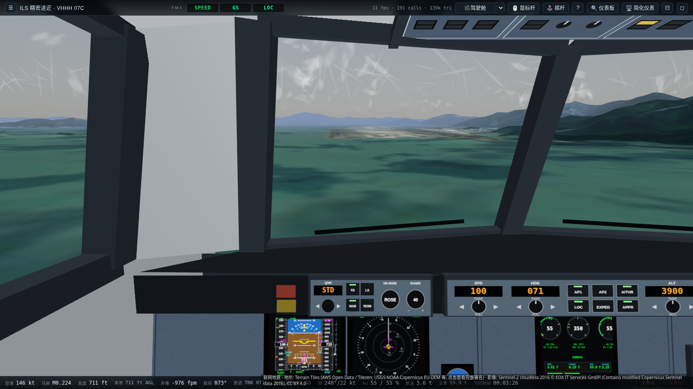
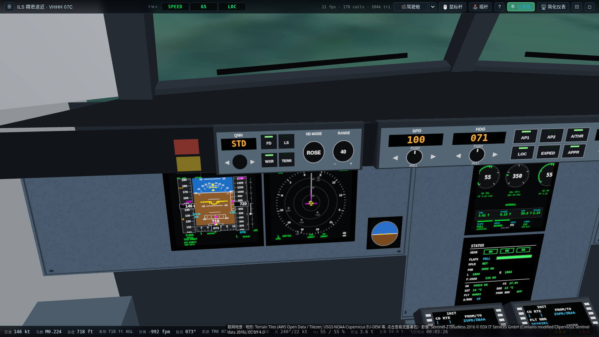
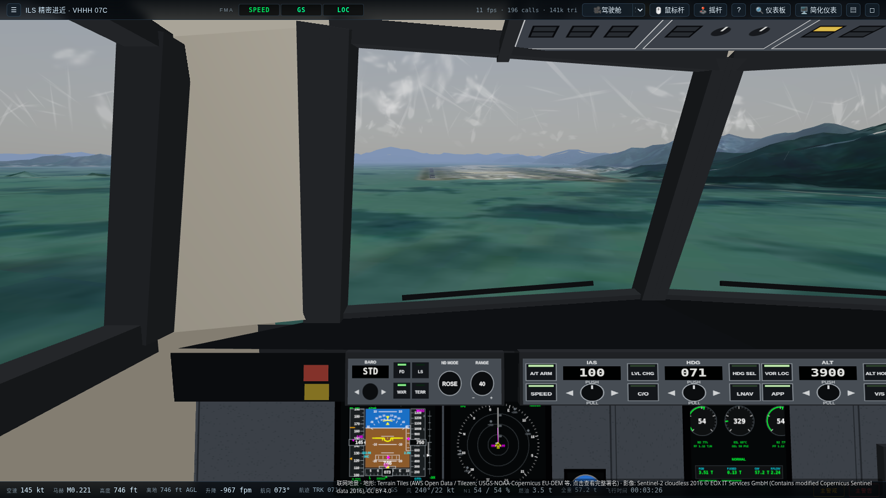
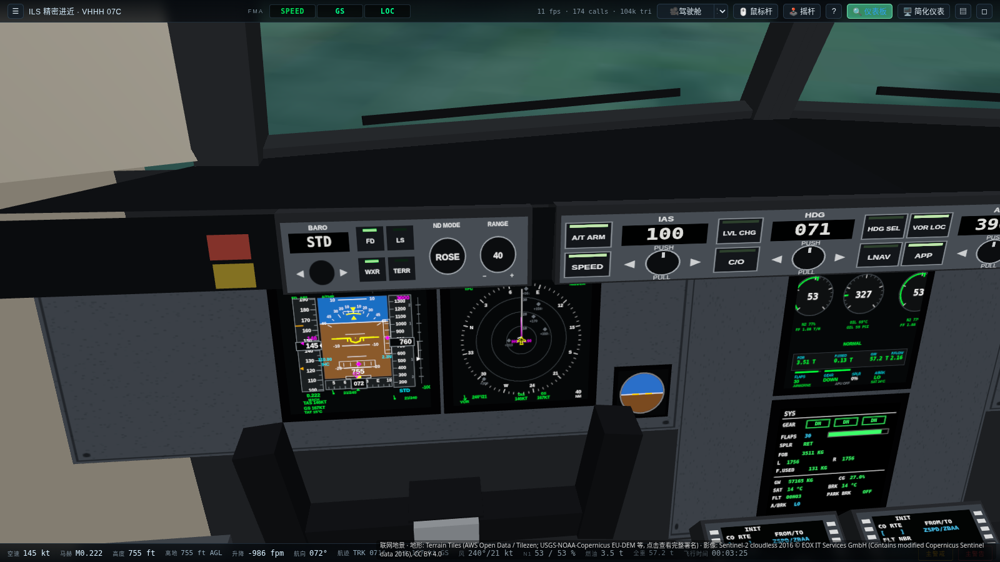

---

## beta 0.3 更新

**更名与图标**：游戏更名为 **天际航线 SkyRoute**，启用全新原创标志与应用图标，界面改用品牌配色（深蓝 `#0B2A5B` / 天蓝 `#2EA3F2` / 橙 `#FF8A3D`）。

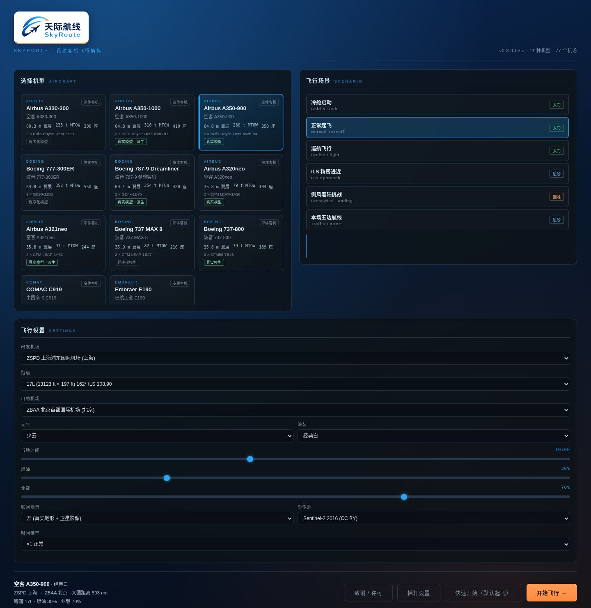

**联网全球地景（可选，默认开启）**

- 主菜单「飞行设置」新增 **联网地景** 开关与影像源选择；也可用 URL 参数 `?online=0|1`、`?imagery=s2-2016|s2-2024|gibs`
- 地形高程：AWS Terrain Tiles（Terrarium 格式，Mapzen/Tilezen，USGS SRTM/3DEP、NOAA ETOPO1、Copernicus EU-DEM 等）
- 卫星影像：默认 **EOX Sentinel-2 cloudless 2016（CC BY 4.0）**；可选 2024 版（CC BY-NC-SA 4.0，**仅限非商业**）或 NASA Blue Marble（低分辨率）
- 四叉树多级细节（LOD），近处最高约 z14，跑道附近地形压平到机场标高、跑道与影像对齐
- 画面右下角显示数据署名（点击查看完整署名），完整条款见 [`ASSETS_LICENSES.md`](ASSETS_LICENSES.md) 第 5 节
- 遵守瓦片使用规范：限并发、限速率、取消不再需要的请求、内存 LRU + 浏览器缓存
- **无缝回退**：断网 / 请求被拦截 / 关闭开关时自动使用内置程序化地形，没有任何报错；地景就绪（约 20 秒）前也先显示内置地形
- 直接双击 `index.html`（file://）也能加载联网地景（各服务的 CORS 均允许）

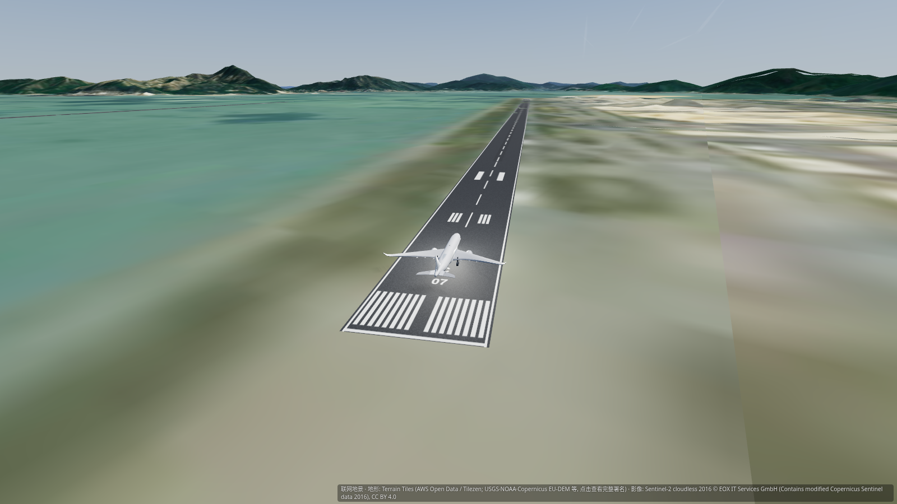
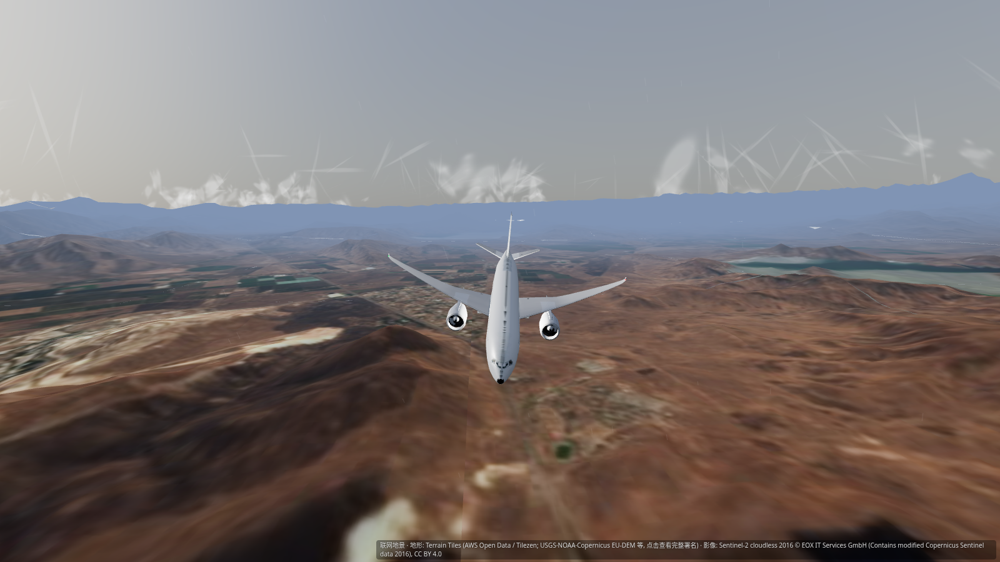

**全新默认键位**（按 `?` 或 `F1` 查看）

- 方向键俯仰/横滚，`PgUp`/`PgDn` 或 `+`/`-` 油门，`,` `.`（或小键盘 `0`/`Enter`）方向舵
- `G` 起落架，`F` / `Shift+F` 襟翼收 / 放，`B` 刹车，`空格` / `P` 暂停
- **`C` 循环切换视角**（驾驶舱 / 追踪 / 自由 …）；顶栏新增 **「🎥 视角」按钮**（点击/触摸循环，右侧下拉可直接选）
- **`M` 鼠标驾驶杆**（光标相对屏幕中心 = 杆量，屏幕中央显示准星）；在画面上拖拽鼠标环视
- 触摸屏：单指拖动 = 驾驶杆，第二根手指 = 环视
- 键位变动：油门由 `Shift`/`Ctrl` 改为 `PgUp`/`PgDn`、`+`/`-`；刹车由 `Space` 改为 `B`，停留刹车 `Shift+B`；
  APU 由 `A` 改为 `Shift+A`；静音由 `M` 改为 `Shift+M`；自动驾驶速度 `Shift+[` / `Shift+]`

**飞行摇杆 / 侧杆 / 油门台（Gamepad API，可选）**

- 支持 Thrustmaster TCA 侧杆、TCA 油门台（Quadrant）及一般 HID 飞行摇杆；Xbox/PS 手柄照旧可用
- 顶栏 **🕹 摇杆** 或主菜单 **「摇杆设置」**：轴映射（俯仰 / 横滚 / 扭转方向舵 / 油门 / 第二油门）、反向、死区、灵敏度、曲线，
  按钮映射（AP 断开、PTT 通话、刹车、起落架、襟翼、视角…），带「检测」学习模式与实时轴显示，设置保存在浏览器本地
- **Chrome / Edge 需要先按一下摇杆上的任意按钮，浏览器才会识别设备**

**修复**

- **A321neo 坐尾**：修正机翼 / 主起落架 / 发动机的纵向位置，停在地面时机身水平，可以正常抬轮起飞
- **迎角保护**：电传机型（A350/A320neo/A321neo/A330/B777/B787/C919）改为真正的迎角指令律，加俯仰姿态限制、
  保护时禁止自动配平抬头和硬迎角限制器；慢车满拉杆 60 秒不会失速（光洁 / 着陆构型均已测试）。
  B737-800 / MAX 8 / E190 是传统操纵，没有包线保护，仍然可能失速（与真机一致）
- 电传机型在地面使用直接法则（静止时不再出现升降舵 / 方向舵自己偏到底）
- **真实跑道道面**：每条跑道都有带标线的道面（中心线、跑道号、入口斑马线、接地区标志）；
  修复浦东 ZSPD 跑道落在海面上、首都 ZBAA 跑道有坡度的问题（跑道区域地形压平）
- **航行灯按实际几何计算**：所有机型的红/绿航行灯、白色尾灯、频闪灯、上下防撞灯、标志灯、着陆/滑行灯
  都由模型顶点实测位置放置（空客/C919 白色尾灯在尾锥，波音/E190 在两侧翼尖后缘）
- 程序化模型的缝翼、襟翼、挂架位置偏移修正
- 涂装改为中性通用名称，空中交通呼号全部改为虚构代码
- 驾驶舱视角不再看到前起落架

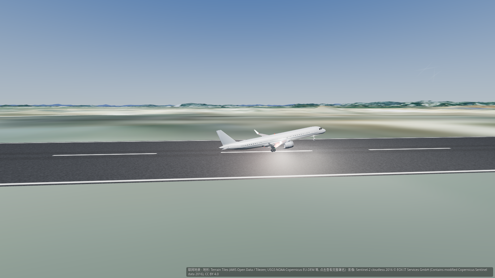
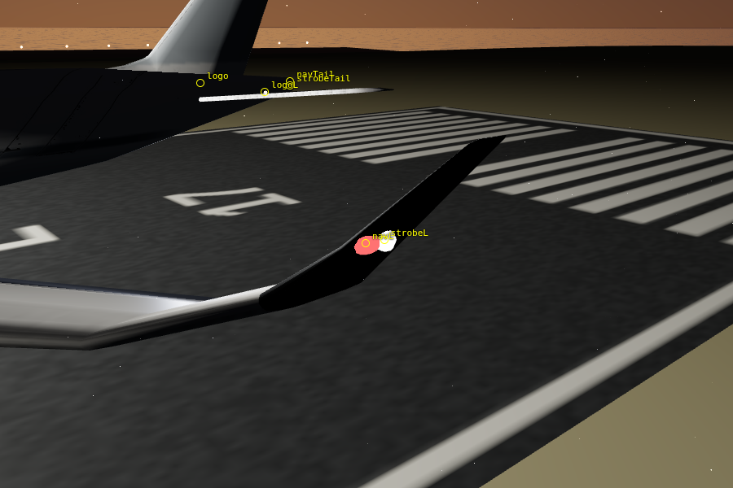

**Windows 桌面版**

- Release 中提供 Windows **免安装便携版**（`SkyRoute-Windows-portable-beta_v0.4-x64.zip`，解压后运行 `天际航线.exe`）。**beta 0.4 无 NSIS Setup.exe**；个别旧版本「如有 Setup」才有安装程序
- 游戏通过内置的 `app://skyroute` 协议本地加载，联网地景、摇杆都可正常使用；`F11` 全屏
- 便携版**未进行代码签名**，首次运行时 Windows SmartScreen 可能提示「已保护你的电脑」，点「更多信息 → 仍要运行」即可
- Microsoft Store 用 MSIX 包（Partner Center 提交；商店页可能滞后于 GitHub）

**测试**

- `node tests/run-tests.js`：新增所有电传机型光洁 / 着陆构型的迎角保护测试、地面模式测试（51 项）
- `node tests/e2e.js`：新增 A321neo 起飞、视角按钮 / C 键 / `?` 帮助、`online=0`、联网地景回退（拦截所有瓦片请求）、
  真实瓦片联网测试（`ONLINE=0` 可跳过）；场景与机型测试固定使用内置地形以保证可复现

---

## beta 0.2 更新

**真实 3D 机型模型**

- 6 种机型改用真实 3D 模型，来源为 [amvlab/aircraft-models](https://github.com/amvlab/aircraft-models)，
  许可证 **CC BY 4.0**，作者 amvlab（Andres Morfin Veytia）：
  - 直接使用：**A350-900、A320neo、B737-800**
  - 派生（在相近机型上加长机身，菜单中标注「派生」）：**A350-1000**（来自 A350）、
    **A321neo**（来自 A320）、**B787-9**（来自 787-8 长度的 B787 模型）
- **A330-300、B777-300ER、B737 MAX 8、C919、E190** 没有找到许可证合适的模型，
  继续使用原来的程序化模型，没有拿其他机型冒充
- 涂装已重绘为不带任何标志的中性白色，菜单中选择的涂装颜色会叠加到垂尾 / 腰线 / 机腹上
- 每个模型 2.7k–5.2k 三角面、一张 1024² 贴图，以 JavaScript 形式内嵌在 `models/` 目录，
  **仍然完全离线，可以直接双击 `index.html`（file://）打开**
- 起落架、灯光、舱门沿用程序化部件；发动机风扇随 N1 转动；
  真实模型上的舵面、反推和机翼弯曲暂时是静态的
- 主菜单新增 **「致谢 / 许可」** 面板，完整说明见 [`ASSETS_LICENSES.md`](ASSETS_LICENSES.md)
- 想换回旧模型：在地址后加 `?procedural=1`

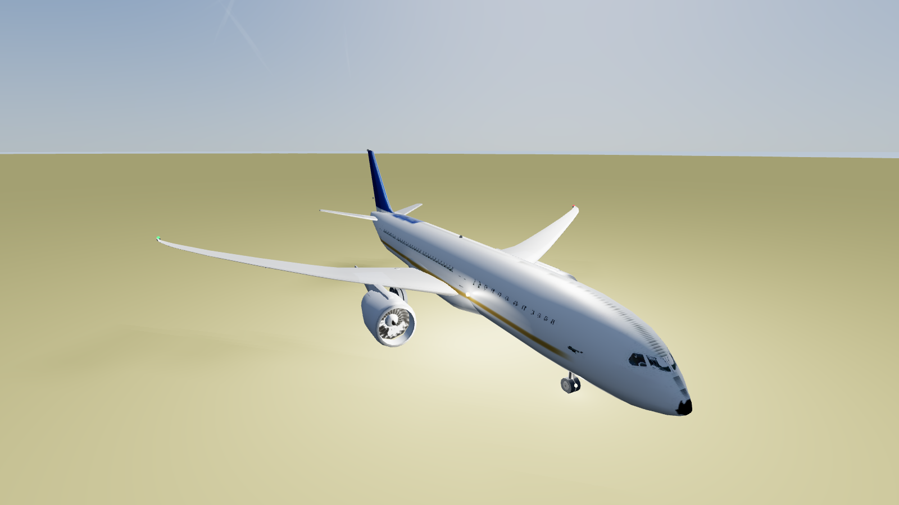
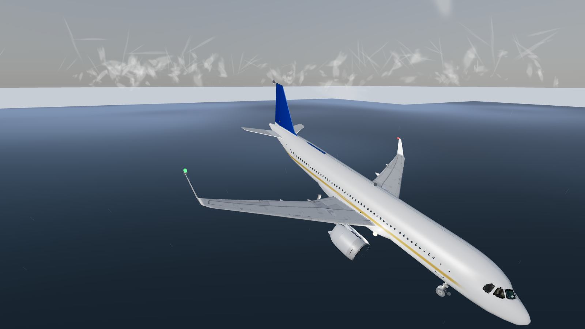

**修复**

- 修复 v0.1 外部视角中飞机模型整体歪斜约 50° 的问题（模型坐标到机体坐标的旋转四元数写错了），
  以及追踪视角的方向（只影响画面，飞行物理没有任何改动）

**测试**

- v0.1 的发布包里没有附带测试文件，beta 0.2 重新编写了测试：
  - `node tests/run-tests.js`：物理 / 自动驾驶 / 模型数据测试，无需安装依赖
  - `node tests/e2e.js`：无头 Chrome 端到端测试（需要 `npm i puppeteer-core`）
- 测试发现的 **v0.1 原有问题**（本版没有修改飞行物理，因此仍然存在）：
  - A321neo 停在地面时会向后坐尾、无法正常起飞
  - 空客正常法则下长时间满拉杆仍会失速（迎角保护不足）
  - 浦东 ZSPD 的跑道位置在地形里是海面，首都 ZBAA 跑道所在地形有约 3° 坡度；
    游戏里没有跑道路面模型（只有跑道灯光）

---

## 目录

- [beta 0.3 更新](#beta-03-更新)
- [beta 0.2 更新](#beta-02-更新)
- [快速开始](#快速开始)
- [按键操作](#按键操作)
- [一次完整的飞行](#一次完整的飞行)
- [功能特性](#功能特性)
  - [机型](#机型)
  - [机场与跑道](#机场与跑道)
  - [飞行场景](#飞行场景)
  - [玻璃座舱](#玻璃座舱)
  - [视角](#视角)
  - [天气与时间](#天气与时间)
- [拟真程度](#拟真程度)
- [技术实现](#技术实现)
- [文件结构](#文件结构)
- [常见问题](#常见问题)

---

## 快速开始

**Windows：** 下载 Release 中的便携版 `SkyRoute-Windows-portable-beta_v0.4-x64.zip` 解压运行（**本版无 Setup.exe**；旧版「如有 Setup」才可安装。未签名，SmartScreen 提示时选「仍要运行」。商店用 MSIX）

**macOS：** 双击 `启动游戏.command`

**任意系统：** 用 Chrome / Edge / Safari 打开 `index.html`（file:// 直接打开即可，联网地景同样可用）

> 推荐使用 Chrome 或 Edge。首次进入某个区域时地形需要现场生成，会有短暂卡顿，属正常现象。

打开后是主菜单，从左边到右边依次选择：

1. **机型** — 11 张卡片，默认推荐 **A350-900**
2. **场景** — 10 个，新手建议从「正常起飞」开始
3. **飞行设置** — 出发/到达机场、跑道、天气、当地时间、涂装、燃油、业载、时间倍率
4. 点 **开始飞行**

进游戏后按 **`?`** 或 **`F1`** 打开完整操作说明。

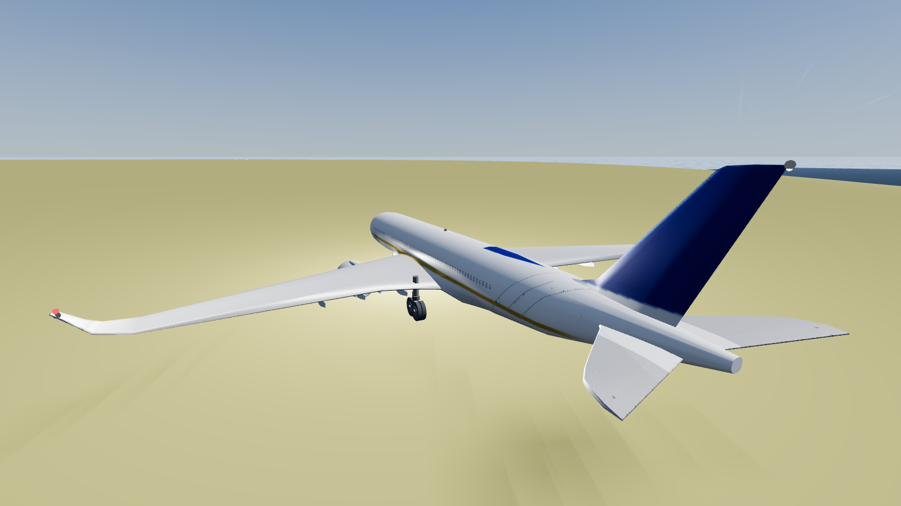

---

## 按键操作

beta 0.3 起采用新的默认键位。游戏内按 `?` 或 `F1` 随时查看。

### 飞行操纵

| 按键 | 作用 |
|---|---|
| `↑` / `↓` | 推杆低头 / 拉杆抬头（也可 `W` / `S`、小键盘 `8` / `2`）|
| `←` / `→` | 左右压杆（横滚；也可 `A` / `D`、小键盘 `4` / `6`）|
| `,` / `.` | 方向舵左 / 右；地面低速时为前轮转向（也可小键盘 `0` / `Enter`、`Q` / `E`）|
| `M` | **鼠标驾驶杆** 开 / 关（光标相对屏幕中心 = 杆量，屏幕中央显示准星；也可点顶栏「🖱 鼠标杆」）|
| `PgUp` / `PgDn`，`+` / `-` | 油门 加 / 减（小键盘 `+` / `-` 也可）|
| `8` / `9` / `0` | 起飞推力 TOGA / 爬升推力 / 慢车 |
| `Home` / `End` | 升降舵配平 低头 / 抬头 |
| `B`（按住）| 机轮刹车 |
| `Shift` + `B` | 停留刹车 |
| `空格` / `P` | 暂停 / 继续 |

### 飞机系统

| 按键 | 作用 |
|---|---|
| `G` | 起落架收放 |
| `F` / `Shift` + `F` | 襟翼收一档 / 放一档（`V` 也可放一档）|
| `X` | 减速板 |
| `R` | 反推预位 |
| `Shift` + `A` | APU 起动 / 停车 |
| `Ctrl` + `S` / `Ctrl` + `1` | 起动全部发动机 / 1 号发动机 |

### 自动驾驶

| 按键 | 作用 |
|---|---|
| `T` | 自动驾驶 接通 / 断开 |
| `Y` | 自动油门 |
| `H` | 航向选择 HDG |
| `J` | 水平导航 LNAV |
| `L` | 高度选择 ALT |
| `K` | 垂直速度 V/S |
| `U` | FLCH 速度优先 |
| `I` | **APPR 进近预位（自动截获 ILS）** |
| `O` | SPD / MACH 切换 |
| `[` `]` | 目标高度 ∓1000 ft |
| `;` `'` | 航向 ∓5° |
| `Shift` + `[` / `]` | 速度 ∓5 kt |

### 视角与界面

| 按键 / 操作 | 作用 |
|---|---|
| `C` / `Shift` + `C` | 循环切换视角（下一个 / 上一个）|
| 顶栏「🎥 视角」按钮 | 显示当前视角名称；点击 / 触摸循环切换，右侧下拉框直接选择 |
| `1` … `7` | 驾驶舱 / 机翼 / 追踪 / 塔台 / 环绕 / 自由 / 飞掠 |
| 在画面上拖拽鼠标 | 环视（开启鼠标驾驶杆时用右键拖拽）；外部视角滚轮缩放 |
| 触摸屏 | 单指拖动 = 驾驶杆，第二根手指拖动 = 环视 |
| `N` | 三维驾驶舱：看向仪表板 / 恢复向外看 |
| 摇杆苦力帽 / `小键盘 5` | 驾驶舱环视 / 视线回正 |
| `Tab` | 显示 / 隐藏侧边面板（检查单、操纵台） |
| `Shift` + `Tab` | 显示 / 隐藏侧边面板（检查单、操纵台）|
| `` ` `` | 显示 / 隐藏整个界面 |
| `?` / `F1` | 操作说明 |
| `Esc` | 暂停菜单 |
| `Shift` + `M` | 静音 |
| `Shift` + `H` | 显示 / 隐藏 HUD |
| `Shift` + `T` | 切换时间倍率 |
| `F2` | 截图 |
| `F11` | 全屏（Windows 桌面版）|

> 原来 `C` 就是切换视角，因此没有功能需要挪位。与旧版相比变动的键：油门（原 `Shift`/`Ctrl`）、刹车（原 `Space`）、
> 停留刹车（原 `P`，现在 `P` 为暂停）、APU（原 `A`）、静音（原 `M`，现在 `M` 为鼠标驾驶杆）、自动驾驶速度（原 `-`/`=`，现在为油门）。

### 游戏手柄

Xbox / PS 布局：左摇杆 = 驾驶杆，`LB` / `RB` 或右摇杆横向 = 方向舵，`LT` / `RT` = 油门，
`A` 起落架，`X` 刹车，`Y` 切换视角，十字键上 / 下 = 襟翼，`Start` 暂停，`Back` 断开自动驾驶。

### 飞行摇杆 / 侧杆 / 油门台

支持 Thrustmaster TCA 侧杆、TCA Quadrant 油门台及一般 HID 飞行摇杆（通过浏览器 Gamepad API）：

1. 连接设备，打开游戏，**先按一下摇杆上的任意按钮** —— Chrome / Edge 出于隐私要求，在按下按钮之前不会把设备报告给网页
2. 点顶栏 **🕹 摇杆** 或主菜单 **「摇杆设置」**
3. 每个设备单独设置：俯仰 / 横滚 / 方向舵（扭转）/ 油门 / 第二油门 对应哪个轴，是否反向，死区、灵敏度、曲线；
   点「检测」后推动某个轴或按下某个按钮即可自动识别
4. 按钮可映射：AP 断开、PTT（按住时屏幕显示「PTT 通话」）、刹车、起落架、襟翼收 / 放、切换视角、反推
5. 设置自动保存在浏览器本地（localStorage），下次插入同一设备自动套用

默认值是按设备名称猜测的（TCA 侧杆：扳机 = PTT，按钮 2 = AP 断开，按钮 3 = 刹车，按钮 4 = 起落架；油门台的第一 / 第二个轴为左右油门），
不同型号的轴编号可能不同，首次使用请在面板里核对一下。

---

## 一次完整的飞行

**起飞**

1. 按 `Shift + F`（或 `V`）放襟翼到起飞位（或点操纵台上的卡位按钮）
2. 按 `8` 推满油门到 TOGA
3. 速度到 Vr（PFD 速度带上的绿色标记）后按 `↓`（或 `S`）柔和拉杆抬头
4. 出现正上升率后按 `G` 收起落架
5. 按速度逐步按 `F` 收襟翼

**爬升与巡航**

1. 按 `T` 接通自动驾驶，`Y` 接通自动油门
2. `L` 设定目标高度，`O` 切换到 MACH 保持马赫数
3. `J` 接通 LNAV 沿航路飞行（需先在菜单里设了目的机场）

**下降与进近**

1. 下降率不超过 2000 fpm，提前 3 海里 / 1000 英尺开始下高
2. 距跑道 12 海里左右按 `I` 预位 APPR
3. 飞机会自动截获航向道（LOC）和下滑道（G/S），**并自动完成拉平接地**
4. 落地后拉反推（`R`），按住 `B` 刹车，用方向舵（`,` `.`）保持跑道中心线

**自动着陆是全自动的** —— 截获下滑道后，系统会跟踪下滑道、在 50 英尺开始拉平、
接地后自动收油门。实测接地率 −51 ~ −125 fpm，与真实自动着陆相当。

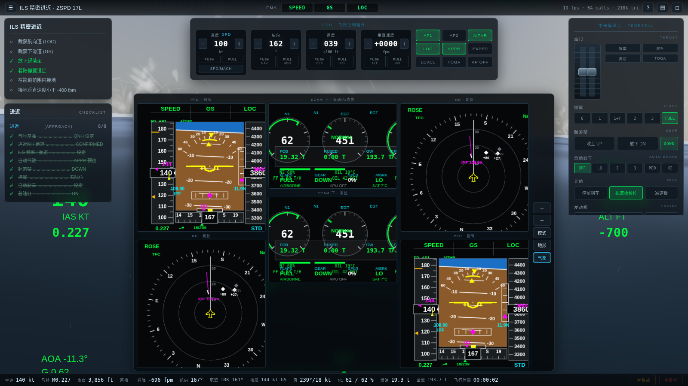

---

## 功能特性

### 机型

**11 种民航客机**，几何尺寸、质量、发动机推力、气动导数全部按公开数据建模：

| 类别 | 机型 | 发动机 |
|---|---|---|
| **宽体** | 空客 A350-900 | 2 × Rolls-Royce Trent XWB-84 |
| | 空客 A350-1000 | 2 × Rolls-Royce Trent XWB-97 |
| | 空客 A330-300 | 2 × Rolls-Royce Trent 772B |
| | 波音 777-300ER | 2 × GE90-115B |
| | 波音 787-9 梦想客机 | 2 × GEnx-1B76 |
| **窄体** | 空客 A320neo | 2 × CFM LEAP-1A26 |
| | 空客 A321neo | 2 × CFM LEAP-1A32 |
| | 波音 737-800 | 2 × CFM56-7B26 |
| | 波音 737 MAX 8 | 2 × CFM LEAP-1B27 |
| | 中国商飞 C919 | 2 × CFM LEAP-1C28 |
| **支线** | 巴航工业 E190 | 2 × GE CF34-10E |

每种机型都有各自的**外形特征**（A350 的弧形鲨鳍翼尖和"浣熊面罩"风挡、
787 的后掠翼尖和四片式风挡、737 的平底机身和融合式小翼、777 的 GE90 巨型短舱），
以及各自的飞行特性（失速速度、V 速度、爬升率、油耗、操纵响应）。

### 机场与跑道

**77 个真实机场 · 462 条跑道 · 416 套 ILS**

坐标、跑道方位、长度、标高、磁差、ILS 频率与航道全部为真实数据。
中国境内 24 个，覆盖浦东、首都、大兴、白云、双流、天府、虹桥、宝安、
长水、咸阳、萧山、禄口、天河、黄花、胶东、桃仙、凤凰、两江、滨海、
中川、地窝堡、白塔等。

其余涵盖亚洲、欧洲、北美、大洋洲、南美、非洲、中东主要枢纽。

### 飞行场景

| 难度 | 场景 | 说明 |
|---|---|---|
| 入门 | **冷舱启动** | 飞机完全断电，按标准程序接通 APU、起动发动机、滑行 |
| 入门 | **正常起飞** | 已对正跑道，推 TOGA 起飞 |
| 入门 | **巡航飞行** | FL350 巡航，练习自动驾驶模式切换与航路导航 |
| 进阶 | **ILS 精密进近** | 12 海里外截获航向道与下滑道，全自动着陆 |
| 进阶 | **本场五边航线** | 完整的起落航线 |
| 进阶 | **夜间飞行** | 依靠仪表保持姿态，跑道灯与城市灯火 |
| 困难 | **侧风着陆挑战** | 25 节正侧风 + 34 节阵风，练习蟹形进近 |
| 困难 | **单发失效处置** | 巡航中一台发动机失效，识别并安全返场 |
| 困难 | **雷雨起飞** | 低能见度、强降雨、湿滑跑道 |
| 自由 | **自由飞行** | 无目标，自由探索 |

每个场景都有实时目标判定和进度提示。

### 玻璃座舱

**主仪表板显示器**：三维驾驶舱中位于主仪表板上（按 `N` 看仪表板）：

- **PFD 主飞行显示 × 2** — FMA 飞行方式通告器、速度带（含速度趋势箭头、
  V1/VR/V2/VLS/VFE/VMO 标记）、姿态指示器（含飞行指引仪、飞行航迹矢量、
  侧滑指示）、高度带（含选择高度和气压基准）、升降速度表、航向带、
  ILS 偏离刻度、无线电高度
- **ND 导航显示 × 2** — ROSE / ARC 两种模式、航路与航路点、距离环、
  地形显示（EGPWS 风格高度着色）、气象雷达回波、TCAS 交通、
  ILS 跑道延长线、风向风速、TAS/GS
- **ECAM 发动机与告警显示 × 2** — N1/EGT 圆形表盘、N2、燃油流量、
  滑油温度压力、反推指示、燃油总览、构型指示（襟翼/起落架/扰流板/
  自动刹车）、告警与备忘信息

另外每种机型都有可用的 **HUD 平视显示器**（`Shift` + `H` 打开）。

### 视角

**12 种视角**：驾驶舱机长位 / 副驾位（beta 0.3.1 起为三维驾驶舱）、客舱舷窗、机翼、追踪、塔台、
环绕、自由飞行、飞掠、起落架、机尾、发动机。

摄像机带有**抖动效果** —— 发动机振动、大气湍流、地面滑行颠簸、
过载变化都会体现在画面里。视野角也会随速度与过载动态变化。

### 天气与时间

**12 种天气预设**：晴空万里、少云、疏云、多云、阴天、降雨、雷暴、
降雪、浓雾、霾/轻雾、大风、晴夜。

- 完整的**昼夜循环**，太阳/月亮位置、天空散射、星空、城市灯火
- **体积云**，可穿越云层、云上飞行
- **降雨、降雪、雷暴**（含闪电和雷声）
- **风与阵风**、大气湍流
- 实时雷达高度表读数驱动的 **GPWS 近地告警**（SINK RATE / TERRAIN /
  PULL UP / 下滑道偏离 / 高度喊话 50-40-30-20-10 / RETARD）

---

## 拟真程度

飞行动力学是真正的**六自由度刚体模型**，而不是"看起来像"的近似：

**气动**

- 升力曲线含失速与过失速特性（失速后升力下降 42%）
- 诱导阻力随升力系数平方增长，地面效应降低诱导阻力并增加升力
- 跨音速阻力发散（临界马赫数取 MMO − 0.065，到 MMO 时阻力增量 0.022）
- 俯仰/滚转/偏航阻尼导数、下洗滞后、操纵效能随动压和迎角变化

**发动机**

- 双转子涡扇模型：N1/N2 转子滞后（加速/减速时间常数不同，高空更慢）
- 推力随密度比和高空马赫数衰减，EGT 随功率变化，起动时序与 EGT 峰值
- 燃油流量由 TSFC 与推力决定，重量随之变化
- 反推、单发失效的不对称推力和偏航力矩

**起落架与地面**

- 弹簧-阻尼支柱（静态压缩约为行程的 35%）、轮胎侧偏刚度、滚动阻力
- 前轮转向（低速时随方向舵偏转，高速限幅）
- 防滞刹车、自动刹车（LO/2/3/MED/HI/MAX）、刹车温度累积
- 湿滑跑道摩擦系数降低、地面扰流板自动放出

**电传操纵**

- 空客机型为**正常法则**：侧杆指令载荷因数（−1g ~ +2.5g）与滚转速率，
  松杆自动回中并自动配平，带迎角保护、过载保护、坡度限制、高速保护
- 波音机型为传统直接法则 + 偏航阻尼器

**校准验证**

用公开数据标定后，模拟结果与真实性能对比：

| 指标 | 模拟结果 | 真实参考 |
|---|---|---|
| A350-900 巡航油耗 (FL350/M0.85) | 5,500 kg/h | ~5,500 kg/h |
| A350-900 巡航升阻比 | 19.9 | ~19 |
| A350-900 起飞滑跑 (197 t) | 1,200 m | ~1,300 m |
| A350-900 V1/VR/V2 (197 t) | 124 / 132 / 140 kt | 相近量级 |
| B737-800 爬升 1500→FL350 | 19 分钟 / 1.3 t 油 | ~20 分钟 / 1.4 t |
| 自动着陆接地率 | −51 ~ −125 fpm | 正常范围 −50 ~ −200 |

---

## 技术实现

- **19,000 行 JavaScript**，纯 ES5 经典脚本，无框架、无打包器、无构建步骤
- **three.js 已本地内置**（`vendor/three.min.js`），整个游戏可完全离线运行
- 除 6 个真实机型模型外（见 [beta 0.2 更新](#beta-02-更新) 与 `ASSETS_LICENSES.md`），资源都是**程序化生成**的：
  - 真实模型以 base64 内嵌在 `models/*.js` 中，用 `<script>` 加载，不需要服务器
  - 其余机型的模型由几何体拼装，机身贴图（舷窗、舱门、腰线、蒙皮分块）用 Canvas 现画
  - 地形、云、海洋、天空都是着色器与噪声函数实时生成
  - **57 种音效全部由 Web Audio 实时合成**（发动机风扇啸叫、核心轰鸣、燃烧脉动、
    排气嘶嘶、气流噪声、GPWS 合成语音、客舱钟、失速抖动……）
- 地形高度是 `(x, z)` 的**纯函数** —— 渲染用的地面和物理碰撞用的地面
  是同一个函数，所以"看到的 = 撞到的"
- 性能：80–100 个 draw call、约 20–24 万三角面，地形分块 LOD 按预算增量重建

---

## 文件结构

```
天际航线/
├── 启动游戏.command         ← macOS 双击这个
├── index.html               主页面
├── README.md                本文档
├── 使用说明.md              简明上手指南
├── ASSETS_LICENSES.md       第三方资源（3D 模型 / three.js / 联网地景数据）许可与修改说明
├── assets/brand/            天际航线 SkyRoute 标志与图标（原创，归项目作者所有）
├── PRIVACY.md               隐私政策（联网地景会访问第三方瓦片服务）
├── desktop/                 Windows 桌面版（Electron）安装包与 MSIX 构建脚本（不包含在 ZIP 中）
├── screenshots/             截图
├── models/                  真实 3D 机型模型（CC BY 4.0，几何 + 贴图，JS 内嵌）
├── tests/                   自动化测试（run-tests.js / e2e.js）
├── tools/model-build/       模型转换脚本（只在重新生成模型时需要）
├── css/style.css            界面样式
├── vendor/three.min.js      本地 three.js（无需联网）
└── js/
    ├── utils.js             数学 / 标准大气 / 地理投影 / 噪声
    ├── config.js            11 种机型的几何、质量、发动机、气动数据
    ├── airports.js          77 个机场 / 462 跑道 / 416 ILS 的真实数据
    ├── flightmodel.js       六自由度飞行动力学 + 发动机 + 起落架
    ├── autopilot.js         自动驾驶（AP/FD/A-THR）+ 飞行管理（LNAV/VNAV）
    ├── aircraft3d.js        3D 飞机模型（真实模型装配 + 程序化模型）
    ├── environment.js       地形 / 天空 / 海洋 / 云 / 降水 / 灯光
    ├── avionics.js          PFD / ND / ECAM / HUD 绘制
    ├── audio.js             Web Audio 实时合成音效
    ├── scenarios.js         飞行场景与标准检查单
    ├── camera.js            12 种摄像机视角
    ├── input.js             键盘 / 鼠标驾驶杆 / 触摸 / 游戏手柄
    ├── joystick.js          飞行摇杆 / 油门台映射与「摇杆设置」面板
    ├── runways.js           带标线的真实跑道道面
    ├── scenery-online.js    联网全球地景（DEM + 卫星影像，LOD，离线回退）
    ├── hud.js               界面控制
    ├── main.js              主循环与系统集成
    └── credits.js           「致谢 / 许可」面板
```

### URL 参数

可以直接用参数跳过菜单进入指定场景：

```
index.html?aircraft=A350-900&scenario=ils-approach&dep=ZSPD&rwy=17R&weather=storm&time=21&autostart=1
```

| 参数 | 取值 |
|---|---|
| `aircraft` | 机型键，如 `A350-900`、`B737-800`、`C919` |
| `scenario` | `cold-dark` `takeoff` `cruise` `ils-approach` `crosswind` `pattern` `engine-failure` `night` `storm-takeoff` `free-flight` |
| `dep` / `arr` | ICAO 机场代码 |
| `rwy` | 跑道号，如 `17R` |
| `weather` | `clear` `few` `scattered` `broken` `overcast` `rain` `storm` `snow` `fog` `haze` `windy` `night-clear` |
| `time` | 当地时间 0–24 |
| `fuel` / `payload` | 0–1 |
| `speed` | 时间倍率 |
| `autostart` | 存在即自动开始飞行 |
| `procedural` | `1` = 所有机型使用程序化模型（不加载真实模型） |
| `online` | `0` = 关闭联网地景，`1` = 开启（只对本次有效，不改菜单设置）|
| `imagery` | 影像源：`s2-2016`（默认，CC BY 4.0）、`s2-2024`（CC BY-NC-SA，非商业）、`gibs`（NASA Blue Marble）|
| `log` | 显示调试日志面板 |

---

## 常见问题

**打不开 / 白屏**
用 Chrome 或 Edge 打开。如果直接双击 `index.html` 有问题，
双击 `启动游戏.command`（会启动一个本地服务器再打开）。

**联网地景不显示 / 一直是程序化地形**
联网地景需要能访问 `s3.amazonaws.com` 与 `tiles.maps.eox.at`；进入飞行后约 20 秒加载完成，期间先显示内置地形。
网络不通时会自动回退到内置地形（菜单「联网地景」也可关闭）。公司 / 校园网络可能拦截这些地址。

**摇杆插上了但没反应**
先按一下摇杆上的任意按钮（Chrome / Edge 的要求），再打开「摇杆设置」检查轴映射。

**Windows 提示「已保护你的电脑」**
便携版 / 安装程序（如有 Setup）没有代码签名证书，点「更多信息 → 仍要运行」即可。

**没有声音**
浏览器要求先有一次用户点击才允许播放音频。点「开始飞行」后就会有声音。
如果还是没声音，检查是否按到了 `Shift + M` 静音。

**帧率低**
缩小浏览器窗口，或换到外部视角。首次进入某片区域时地形需要生成，
会有短暂卡顿。也可以在菜单里把时间倍率设成 ×0.5。

**飞不稳 / 老是掉下来**
按 `T` 接通自动驾驶、`Y` 接通自动油门，让飞机自己飞。用鼠标飞可以按 `M` 打开鼠标驾驶杆。
想练手动飞行时，注意空速不要掉到 PFD 速度带下方的琥珀色标记以下。

**想快点飞完**
菜单里把「时间倍率」设为 ×2 或 ×4。

**怎么落得准**
按 `I` 预位 APPR，系统会自动截获 ILS 并完成着陆。手动着陆时，
提前 3 海里 / 1000 英尺开始下高，10 海里外放起落架和着陆襟翼。

---

## 许可

本地自用项目，目前**没有代码许可证**（v0.1 发布包中也没有）。three.js 为 MIT 许可，随附于 `vendor/`。
真实 3D 机型模型来自 amvlab/aircraft-models，按 CC BY 4.0 使用；联网地景数据（AWS Terrain Tiles、EOX Sentinel-2 cloudless、NASA GIBS）按各自条款在线加载、不随项目分发；
详见 [`ASSETS_LICENSES.md`](ASSETS_LICENSES.md)。天际航线 SkyRoute 的标志与图标（`assets/brand/`）为原创作品，归项目作者所有。
